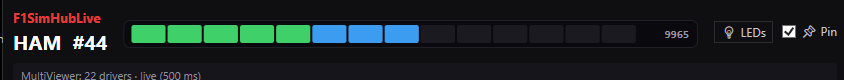

# F1SimHubLive Driver Picker — UI Reference

Companion document to the [main README](README.md). This is the *user's guide* to the **F1SimHubLive Driver Picker** window — every panel, button, column, and colour, plus the gotchas that aren't obvious from looking at it.

> **Path:** `C:\Program Files (x86)\SimHub\F1SimHubLive-Picker.exe`
> **Window size:** 860 × 960 (resizable, MinWidth=760, MinHeight=540)
> **Always-on-top:** toggle via the 📌 Pin button in the header
> **Privileges:** runs as administrator (UAC prompt on launch) — required to write `settings.json` under `Program Files (x86)\SimHub\`

<!-- Screenshot to be added: docs/screenshots/picker-overview.png — full window with live MV session, annotated callouts -->


---

## What it is in one paragraph

Standalone WPF live-timing replica that mirrors MultiViewer's leaderboard for the current F1 session. One click on a driver row writes the new `DriverNumber` to the plugin's `settings.json`; SimHub's `FileSystemWatcher` picks up the change within ~250 ms and your wheel flips to that driver inside ~1 second — **no SimHub restart, no MultiViewer re-warm-up**. The picker also shows per-driver live speed, RPM (for the selected driver), tyre, gap/interval, pit-stop count, sector segments, and sector times with personal-best (yellow) / session-best (purple) colour coding — matching MV's own UI.

---

## Header bar (top of window)

The header is the always-visible strip at the top, dark-themed to match Windows 11 dark mode and MultiViewer's chrome.

<!-- Screenshot: docs/screenshots/picker-header.png — close-up of header, ideally with engine spun up so LEDs are mid-stack -->



```
┌──────────────────────────────────────────────────────────────────────────────┐
│  F1SimHubLive   ▮▮▮▮▮▮▮▮▮░░░░░░  8,742 RPM        [ LEDs ON ]  [ 📌 Pin ]   │
│  HAM #44                                                                      │
└──────────────────────────────────────────────────────────────────────────────┘
```

| Element | Purpose |
|---|---|
| **`F1SimHubLive` label** | App name. Cosmetic only. |
| **`HAM #44` sub-label** | Currently-active driver — TLA + racing number. Updates the instant you click a different row. |
| **Horizontal LED bar** | 15-LED preview that mirrors what your physical wheel's LEDs are doing right now: bottom 5 = green (low RPM), next 5 = red (mid RPM), top 5 = blue / shift-warning (high RPM, flashes at the shift point). Left→right = low→high RPM. Sourced from MV's CarData channel `0` (RPM) for the active driver. |
| **RPM readout** | Numeric RPM for the selected driver, updated ~5×/sec. Shows `—` when telemetry isn't flowing. |
| **`LEDs ON / LEDs OFF` toggle** | Master switch for the header LED bar. Turning OFF freezes the bar at all-dark. Does NOT affect the physical wheel — that's controlled by SimHub's own LED profile, not this app. |
| **`📌 Pin` toggle** | Always-on-top. When pinned, the window stays above SimHub, MultiViewer, the game, browsers, etc. — useful when running on a second monitor. |

**Why it's there:** the LED bar is a sanity check. If the picker shows LEDs lighting up but your wheel doesn't, the gap is between SimHub and the wheel (not between MV and SimHub). Conversely, if both are dark, look upstream — MV not connected, or no session loaded.

---

## Status line (under the header, conditional)

A single line of grey text that only appears when something is wrong:

| Message | Meaning |
|---|---|
| *(no line)* | All good. MV reachable, data flowing. |
| `Waiting for MultiViewer...` | The first call to `http://localhost:10101` hasn't returned yet. Normal during startup. |
| `Live timing offline: <error>` | Three consecutive poll failures. MV is closed, no session is loaded, or networking is broken. Picker keeps retrying every 500 ms. |

---

## Driver list (the main grid)

Scrollable list of every driver in the current MV session, **sorted by position**. Each row is 72 px tall. Drivers with position `0` (no position assigned — pre-session, formation lap) are pushed to the bottom so the live order stays clean.

The scrollbar is dark-themed to match.

<!-- Screenshot: docs/screenshots/picker-row-anatomy.png — close-up of a single row with column callouts (pos, TLA, name/team, speed, last/best, int/gap, tyre, pit, sectors) -->


```
┌──┬────┬───────────────────┬──────┬───────────────┬───────────────┬──────┬───┬──────────────────┐
│ 1│LEC │ Leclerc           │ 322  │ LAST 1:15.121 │ INT     —     │ ⓗ   │ 2 │ ▮▮▮▮▮▮▮▮  ▮▮▮  │
│  │    │ Ferrari           │ km/h │ BEST 1:14.928 │ LDR     —     │ L18 │   │ 19.546 35.382   │
│  │    │                   │      │               │               │     │   │ 19.533 35.382 19.871│
├──┼────┼───────────────────┼──────┼───────────────┼───────────────┼──────┼───┼──────────────────┤
│ 2│HAM │ Hamilton          │   0  │ LAST IN PIT   │ INT +0.182    │ ⓗ   │ 2 │ ▮▮▮  ▮▮▮▮▮▮     │
│  │    │ Ferrari           │ km/h │ BEST 1:15.110 │ LDR +0.182    │ L16 │   │ 31.975 39.008   │
│  │    │                   │      │               │               │     │   │ 19.641 35.375 20.094│
└──┴────┴───────────────────┴──────┴───────────────┴───────────────┴──────┴───┴──────────────────┘
   ↑    ↑                  ↑      ↑              ↑               ↑     ↑    ↑
   pos  TLA  name/team    speed  LAST/BEST    INT/GAP          tyre   pit  sectors (3 cols × 3 rows)
```

### Columns, left to right

| # | Column | Width | What it shows | Source |
|---|---|---|---|---|
| 0 | **Position** | 36 px | Driver's current race / qualifying position. Bold white. `—` when zero. | `TimingData.Lines[*].Position` |
| 1 | **TLA tile** | 60 px | Three-letter abbreviation on a tile coloured with the constructor's official team colour (Ferrari red, Mercedes silver, etc.). | `DriverList.Tla` + `TeamColour` |
| 2 | **Name + team** | flexible | Last name in bold + team name in subtler grey under it. | `DriverList.LastName` + `TeamName` |
| 3 | **Speed** | 78 px | Current car speed in km/h, big bold Consolas number with a tiny `km/h` under it. Updates ~5×/sec for **every car** (not just the selected one). `0` when telemetry is paused / driver in pit. | MV `CarData` channel `2` for that car's racing number |
| 4 | **LAST + BEST lap** | 95 px | Two-row stack. `LAST` row shows the most recent completed lap (or `IN PIT` when the driver is in the pit lane). `BEST` row shows the personal best lap of the session. Colour-coded — see [Time colour scheme](#time-colour-scheme) below. | `TimingData.Lines[*].LastLapTime` + `TimingStats.Lines[*].PersonalBestLapTime` |
| 5 | **INT + GAP** | 80 px | Two-row stack. `INT` = gap to the car directly ahead. `LDR` = gap to the race leader (`—` for P1, who *is* the leader). Negative values render as `+x.xxx`. | `TimingData.Lines[*].TimeDiffToPositionAhead` + `TimeDiffToFastest` |
| 6 | **Tyre badge** | 58 px | Coloured circle with a single letter (S/M/H/I/W) representing the current compound, and the lap number of the stint (`L18` = 18 laps on this set) under it. See [Tyre colour scheme](#tyre-colour-scheme). | `TimingAppData.Lines[*].Stints[<last>]` |
| 7 | **Pit count** | 34 px | Number of pit stops completed. Hidden when zero. | `TimingData.NumberOfPitStops` (falls back to `Stints.Count - 1`) |
| 8 | **Sector strip** | 200 px | Three sectors side-by-side. Each sector has **three rows** (top = segment mini-bars, middle = current lap's sector time, bottom = personal-best sector time). See [Sector strip](#sector-strip) below. | `TimingData.Lines[*].Sectors[]` + `TimingStats.Lines[*].BestSectors[]` |

### Time colour scheme

Lap times and sector times follow MultiViewer's universal convention:

| Colour | Meaning | When it applies |
|---|---|---|
| ⚪ **White / off-white** | Plain time, no flag | Default — the time is recorded but neither a PB nor SB |
| 🟡 **Yellow** | Personal Best | The driver's own fastest time of the session for this lap / sector, but not the fastest in the field |
| 🟣 **Purple** | Session Best (a.k.a. Overall Fastest) | The fastest time in the field for this lap / sector |
| 🔴 **Red** | In Pit | LAST cell only — shown when the driver is currently in the pit lane (otherwise rendered as a normal time) |
| ⬜ **Grey (dim)** | Empty / not set | Sector or lap has no recorded time yet |

The picker pulls the authoritative `Position` field from MultiViewer's `TimingStats` endpoint — `Position == 1` means session best (purple), any non-zero position means at minimum a personal best (yellow). This is the same source MV's own UI uses, so colours match exactly.

### Sector strip

Each driver row's right-most column is a three-sector strip mirroring MV's leaderboard:

```
┌───────────┬───────────┬───────────┐
│ ▮▮▮▮▮     │ ▮▮▮▮▮▮▮▮ │ ▮▮▮▮      │   ← mini-bar segments (top row)
│  19.546   │  35.382   │  19.871   │   ← current sector time (middle row)
│  19.533   │  35.382   │  19.871   │   ← personal-best sector time (bottom row)
└───────────┴───────────┴───────────┘
       S1          S2          S3
```

**Top row — segment mini-bars:**
F1's marshalling system divides each sector into 5–10 "mini-sectors." Each bar represents one mini-sector and is colour-coded by the driver's instantaneous status through it:

| Bar colour | Meaning |
|---|---|
| 🟡 Yellow | Normal, no special flag |
| 🟢 Green | Personal best mini-sector |
| 🟣 Purple | Session-best mini-sector |
| ⬛ Dark grey | Mini-sector not yet completed |
| 🟦 Blue | Pit lane (driver is in the pit during this mini-sector) |
| 🔴 Red | Yellow flag / yellow flag active for this mini-sector (rare; shows briefly) |

**Middle row — current sector time:**
The time the driver just set for this sector on the **current** lap. Colour-coded per the [time scheme](#time-colour-scheme).

**Bottom row — personal-best sector time:**
The driver's fastest time **ever** in this sector during the session. Yellow if it's only their PB; purple if it's also the field's session best. Blank during early laps before any sector has been completed.

> **Cross-reference:** if the bottom row is purple, you'll also see a purple mini-bar in the top row for whichever mini-sector inside that sector belongs to the SB lap.

### Tyre colour scheme

MV-standard F1 tyre compound colours, used on the badge in column 6:

| Letter | Compound | Colour | Hex |
|---|---|---|---|
| **S** | Soft (slick) | Red | `#E83A3A` |
| **M** | Medium (slick) | Yellow | `#F5C518` |
| **H** | Hard (slick) | White | `#F5F5FA` |
| **I** | Intermediate (wet) | Green | `#3FD06A` |
| **W** | Wet (full wet) | Blue | `#3C9CF0` |
| **?** | Unknown / test compound | Grey | `#7F7F8A` |

The `L<n>` text under the letter is the stint age in laps (resets to 0 on pit-stop with a tyre change).

### Currently-active row

The driver currently selected (i.e. the one your wheel is showing) gets a coloured border that runs around the entire row. This is the same driver shown in the header's `HAM #44` sub-label. When you click a different row, the border jumps immediately to confirm the click was registered (~250 ms before the wheel itself catches up).

---

## Interactions

### Single click on a driver row

1. The row flashes green for ~500 ms (visual confirm).
2. The picker writes `DriverNumber` = that driver's racing number to `C:\Program Files (x86)\SimHub\F1SimHubLive.Settings.json`.
3. SimHub's `FileSystemWatcher` picks up the file change within ~250 ms.
4. The wheel's LEDs, speed, gear, RPM, gap, sectors swap to the new driver inside ~1 second total.

**No SimHub restart, no MultiViewer re-warm-up.**

### Scrolling

Mouse wheel or click-drag the dark scrollbar on the right. There's no virtualisation — all 20 driver rows are always in memory, so scrolling is instant.

### Pinning / unpinning

Toggle the 📌 button. State is **not** persisted across launches (intentional — most users want the default behaviour to depend on the screen they're launching it on).

### Window resize

Drag any edge. The driver list expands; the header stays fixed-height. Minimum size is enforced at 760 × 540 — below that the columns start to collide.

### Closing

Closing the picker window doesn't stop the plugin. The wheel keeps showing whichever driver was last selected. To switch drivers without the picker open, edit `settings.json` manually — same hot-reload path.

---

## Data sources (which MV endpoint feeds what)

The picker hits MultiViewer's local REST API at `http://localhost:10101`. All endpoints under `/api/v1/live-timing/<feed>` are SignalR feeds proxied as JSON.

| Endpoint | Poll rate | Used for |
|---|---|---|
| `/api/v1/live-timing/DriverList` | every 30 s | Driver TLA, name, team, team colour |
| `/api/v1/live-timing/TimingData` | every 500 ms | Position, current sector times, lap times, pit status, gap, interval, segments |
| `/api/v1/live-timing/TimingAppData` | every 500 ms | Stints / tyre compound / stint age / pit count |
| `/api/v1/live-timing/TimingStats` | every 500 ms | **Authoritative** personal-best lap + best-sector times with Position ranking (this is what makes PB / SB colours stay correct even when joining mid-session) |
| `/api/v2/livetiming/cardata/<lap>` (or live equivalent) | every 200 ms | Per-driver RPM (channel `0`) + per-driver speed (channel `2`) |

If MV is closed or any endpoint 404s, the picker logs the failure to the status line and keeps retrying. `TimingStats` failures are silently tolerated — older MV builds without that endpoint fall back to a client-side running-min PB tracker (less accurate for mid-session joins, but functional).

---

## Settings & launch options

The picker doesn't have its own settings file. Behaviour is controlled by two fields in the plugin's `settings.json`:

| Field | Default | Effect |
|---|---|---|
| `DriverNumber` | `"44"` | The currently-active driver. Picker writes here on click. Plugin watches the file and hot-reloads. |
| `AutoLaunchPicker` | `false` | When `true`, the plugin spawns the picker every time SimHub starts. Off by default because the picker is admin-manifested and triggers a UAC prompt each launch. The Start Menu shortcut is the recommended manual-launch path. |

---

## Troubleshooting

**Picker opens but shows "Waiting for MultiViewer..." forever:**
- MultiViewer isn't running, OR no session is loaded, OR you haven't clicked "Replay Live Timing" on a recorded session.
- Confirm in a browser: `http://localhost:10101/api/v1/live-timing/DriverList` should return JSON, not 404 / connection refused.

**Drivers appear but stay in race-number order, not position order:**
- The session hasn't run far enough to assign positions (formation lap, pre-session). Normal — positions fill in once running laps start.

**Last lap shows `IN PIT` but driver is clearly on track:**
- MV's `InPit` flag has a few-second latency at the pit exit. Self-resolves on the next tick.

**Sector mini-bars all yellow, never purple/green:**
- Either no PB has been set yet this session, or `TimingStats` isn't being served (older MV build). Bottom row of the sector strip will also be empty in that case. Update MV to the latest.

**Click doesn't change the wheel:**
- The row flash means the click was registered. If `settings.json` didn't change, the picker hit a permission error — re-run elevated (Start Menu shortcut path inherits the admin manifest).
- If `settings.json` DID change but the plugin didn't react, check SimHub's plugin log for `[F1SimHubLivePlugin]` — should show `Driver changed: 44 → 12`. No line means `FileSystemWatcher` didn't fire; verify both the plugin and picker resolve to the same `settings.json` path under `Program Files (x86)\SimHub\`.

**UAC prompt every launch is annoying:**
- Unavoidable without dropping the `requireAdministrator` manifest, which the picker needs to write to `Program Files (x86)\SimHub\settings.json`. The clean fix is to leave `AutoLaunchPicker = false` and just accept one UAC per intentional launch.

**Times look wrong / different from MultiViewer's leaderboard:**
- This shouldn't happen as of v1.2.4, which sources `BestSectors` and `PersonalBestLapTime` directly from MV's `TimingStats` endpoint. If you see a divergence, file an issue with a screenshot of both windows side-by-side.

---

## Version history (UI-relevant)

| Version | UI changes |
|---|---|
| **v1.1.0** | Original Driver Picker — small (~320 × 640) team-grouped grid, click-to-switch. |
| **v1.2.0** | Live-timing replica view introduced. Vertical RPM LED strip on left, scrollable driver list with TLA tiles + name + team. |
| **v1.2.1** | Dark title bar + dark scrollbar (matches Windows 11 + MV). |
| **v1.2.2** | LED strip relocated from left vertical column into the header bar (horizontal). LED order corrected (green → red → blue runs left → right). |
| **v1.2.3** | Per-driver speed column (km/h) added. Sector strip restructured to three rows (segments / current / best). Row height 64 → 72; window 760 → 860 wide. |
| **v1.2.4** | `TimingStats` endpoint wired up — PB / SB colours on lap and sector times now match MV exactly, even when joining mid-session. |

---

*Want to contribute an annotated screenshot? Drop a PNG into `docs/screenshots/` named `picker-<thing>.png` and replace the `<!-- Screenshot... -->` placeholder with a standard markdown image tag.*
